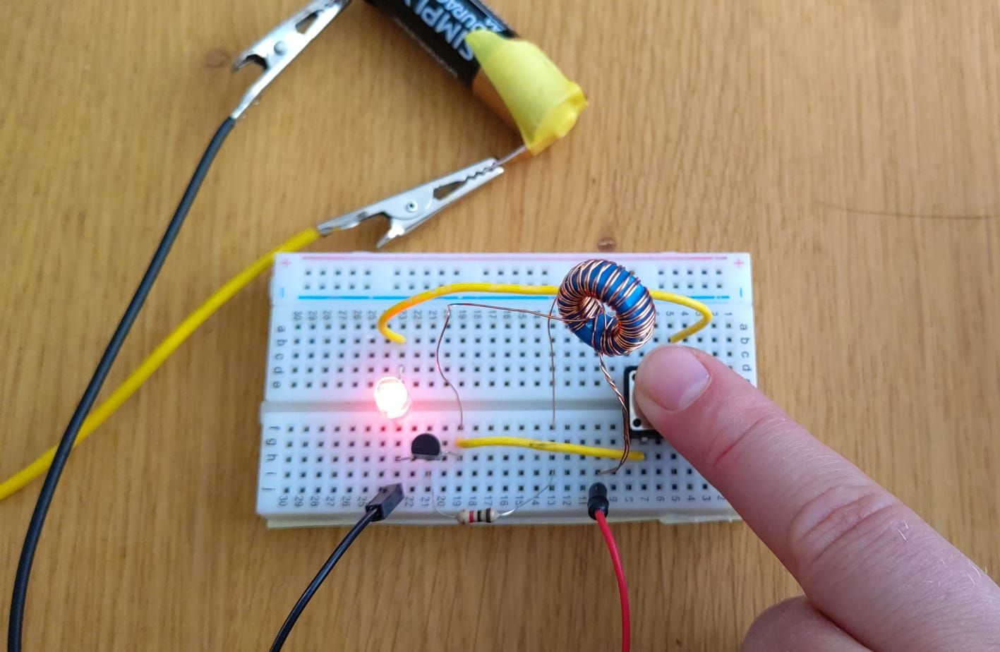
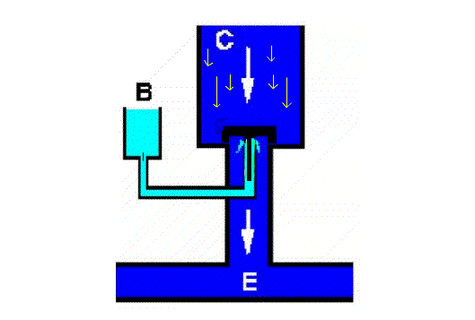
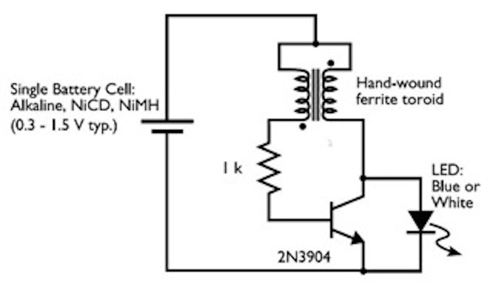
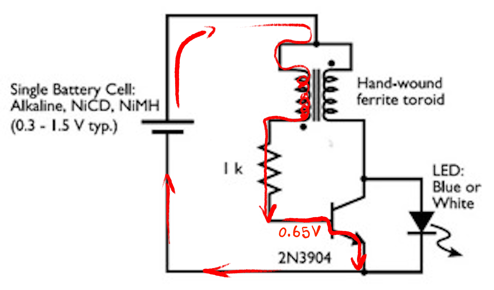
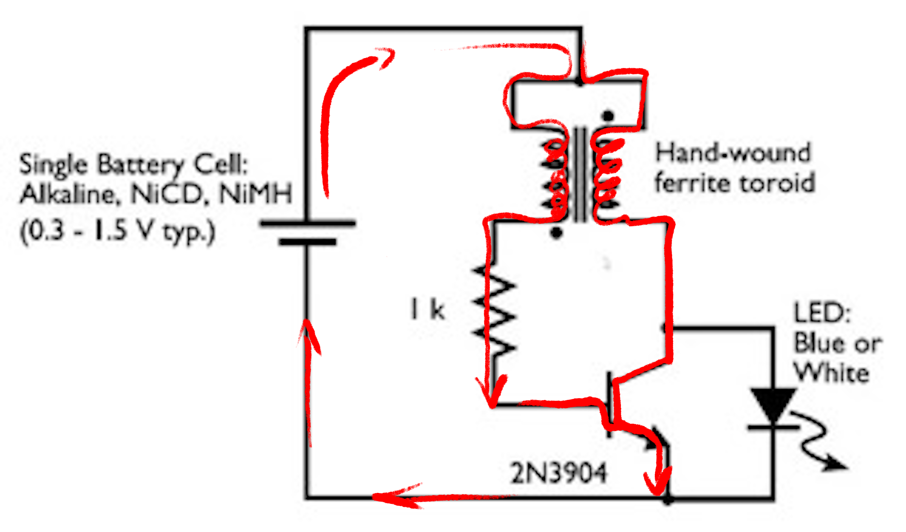
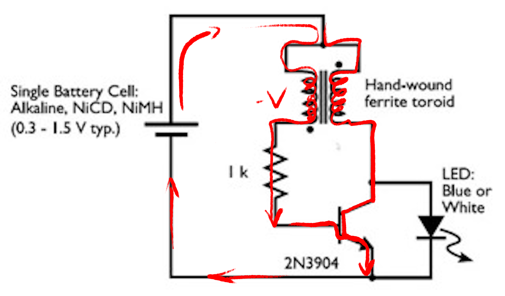
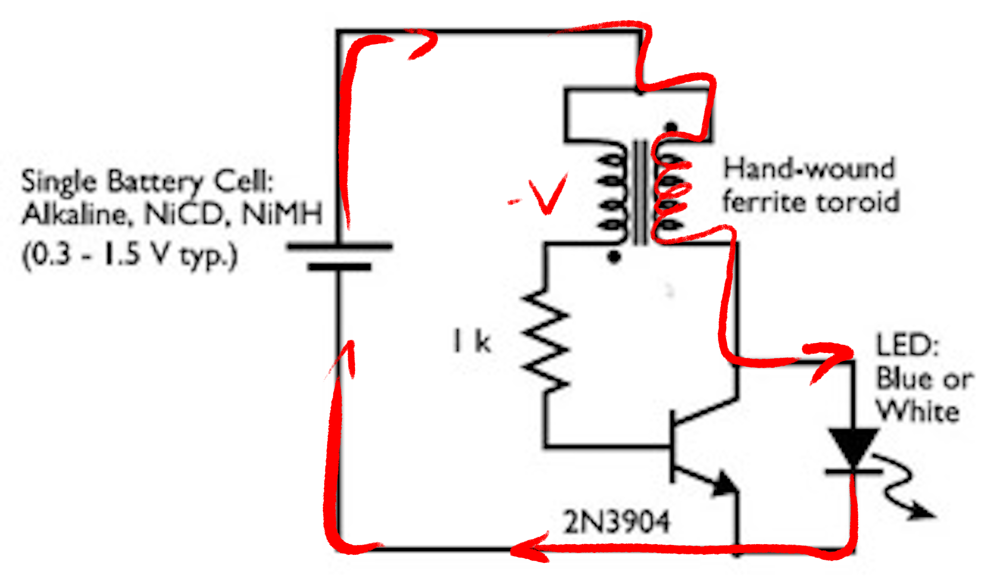
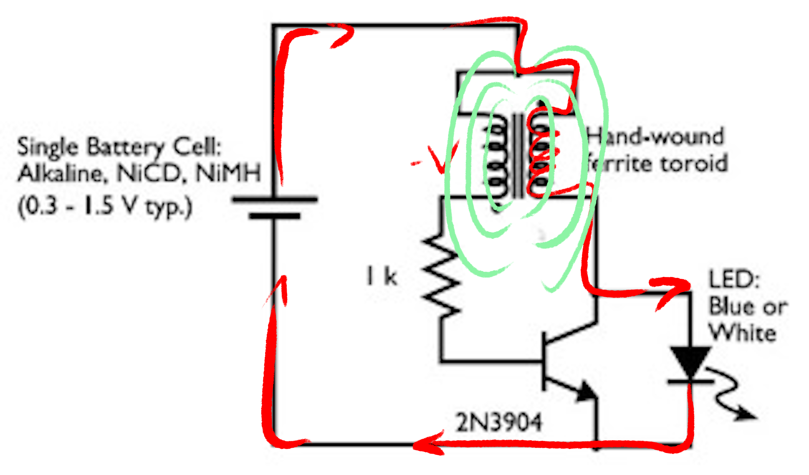
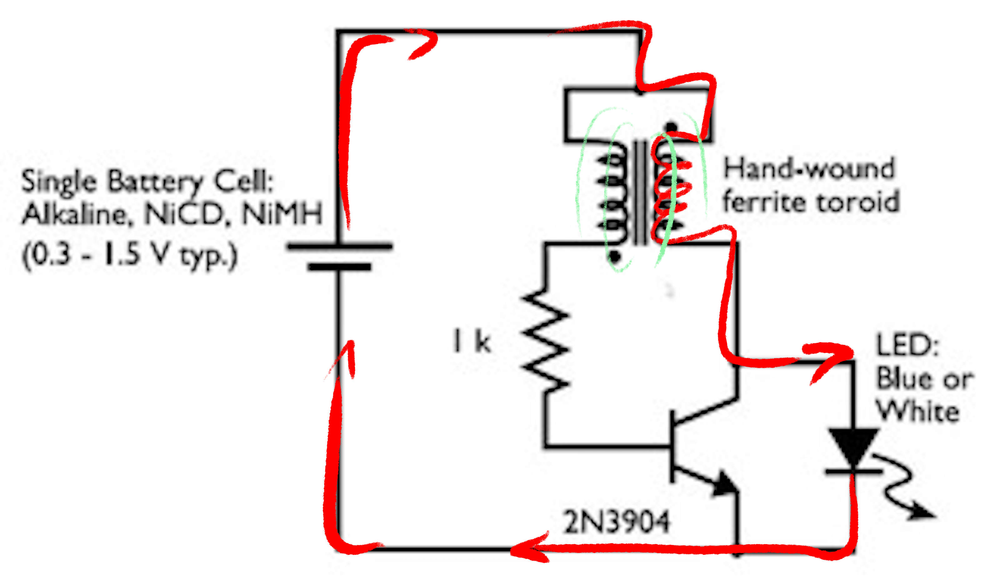
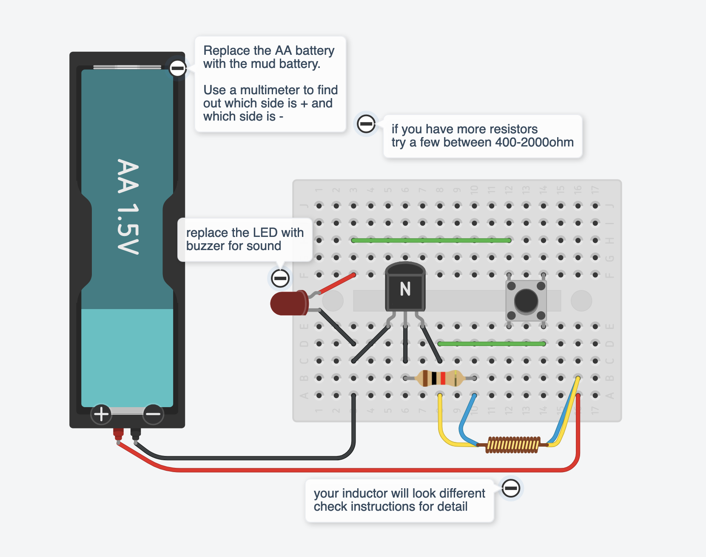

:title: Soilpunk Joulethief
:author: Heerko van der Kooij
:description: 
:css: slides.css

.. header::

  Soilpunk 🌏🤘 - Joulethief

----

Soilpunk - Joulethief
======================

This document is viewable as `a webpage <https://github.com/hackersanddesigners/Soilpunk_technical_setup/blob/master/slides.rst>`_ or as `a slideshow <https://hackersanddesigners.github.io/Soilpunk_technical_setup/html_output/index.html>`_

----

:id: joulethief

Joulethief
========================

----

Transistor
==========

----

Joulethief
========================

----

:id: joulethief-step1

Joulethief
========================

 
A small current flows from the battery through the coil and the base-emitter path of the transistor. This opens the emittor-collector path of the transistor.

----

Joulethief
========================

	
Electricity is now able to travel through the second coil and through the collector-emitter channel of the transistor.

----

Joulethief
========================

	
The increasing amount of electricity through the second coil generates a negative voltage in the first coil.
An negative voltage is induced in the first coil, which cause the transistor to close. 

----

Joulethief
========================

With the transistor closed the energy starts to flow through the output (led).

----

Joulethief
========================

The inductor is now powered by the magnetic field of the coil. 

----

Joulethief
========================

When the magnetic field is gone, the whole process `starts over <#joulethief-step1>`_.

----

Joulethief
========================
A more detailed explanation can be found on `instructables <https://www.instructables.com/Joule-Thief-Circuit-How-to-Make-and-Circuit-Explan/>`_

----

----

https://github.com/hackersanddesigners/Soilpunk_joulethief
